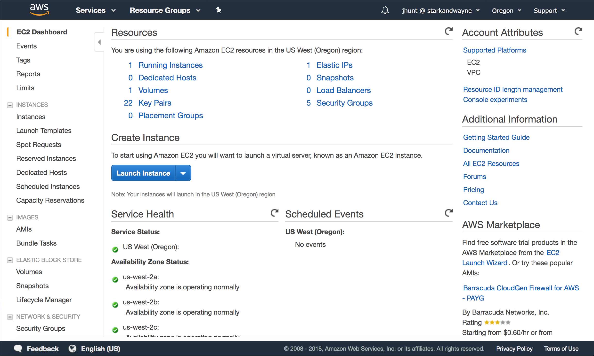
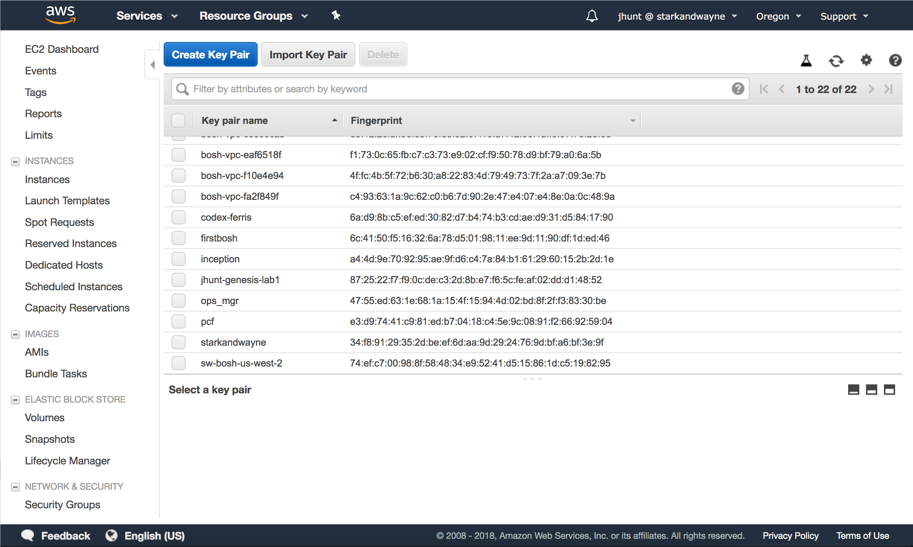
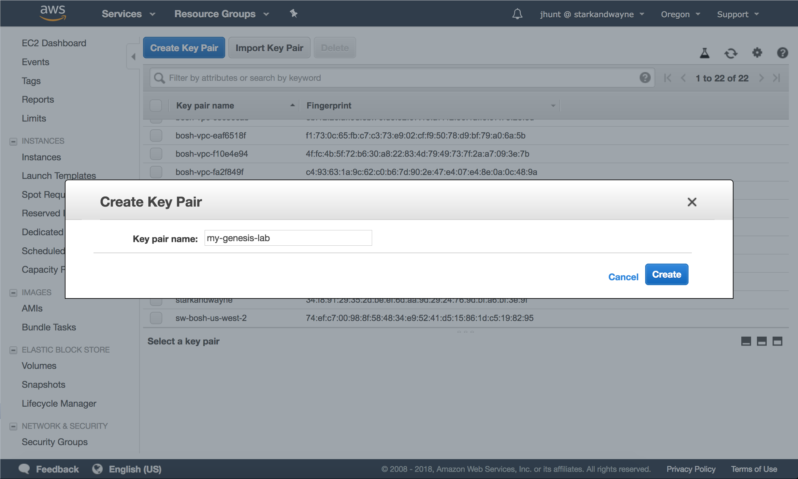
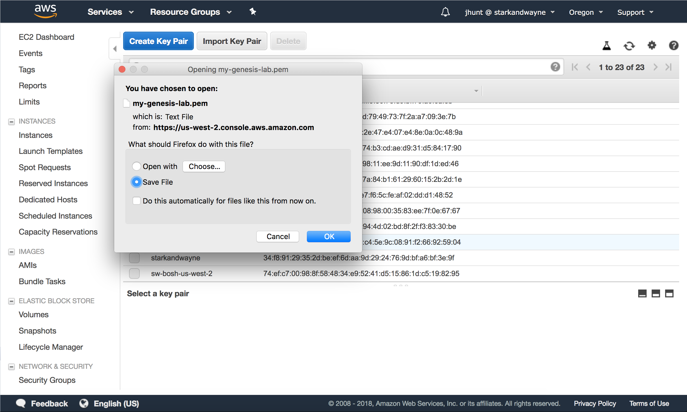

Genesis Terraform - AWS Training Lab
====================================

If you're here, I'm assuming you want to provision a small but
usable training environment in AWS, for Genesis deployments.

This Terraform configuration gives you the following, in AWS:

1. A VPC with a single /20 lab network
2. A default route to the public Internet
3. A Bastion Host with all Genesis pre-requisites installed
4. A default security group that allows all traffic
5. Enough networks to run Concourse across three AZs

This is designed to get you up and going, with minimal friction on
the network front (no fighting with overbearing security groups or
routing restrictions), but still give you room to grow.


Deploying an AWS Training Lab
-----------------------------

To get started, you're going to want to create an `aws.tfvars`
file, which should contain all of the relevant information about
the AWS environment you want to deploy.  Here's an example:

```
aws_access_key = "..."
aws_secret_key = "..."
aws_region     = "us-west-2"
aws_vpc_name   = "jhunt-genesis-lab1"
aws_key_name   = "jhunt-demos"
aws_key_file   = "jhunt-demos.pem"
```

You're going to want to put your AWS Access Key (AKI) and Secret
Key ID values in this file.  By default, `*.tfvars` files are
ignored by the git configuration in this repository, so you should
be OK.

The value of the `aws_vpc_name` variable is entirely up to you.
All of the things that this Terraform configuration creates will
have this value incorporated into their name, to keep you from
stepping on the toes of other Genesis Terraform configurations.

Finally, you will need to generate an **EC2 Key Pair** for
Terraform (and later BOSH) to use for deploying against AWS.  From
the **EC2 Dashboard**, find (and click on) the **Key Pairs** link:



That will bring you to the list of provisioned key pairs:



Click **Create Key Pair** to generate a new one.  You are free to
name your key pair whatever you want, but it's a good idea
to incorporate the value you set for `aws_vpc_name`.



When you click **Create** button, your browser will start to
download the private key file, in PEM format:



_This is the only opportunity you will have to obtain the private
key.  **Put this file in a safe, secure location!** If you
misplace it, you will have to generate a new key pair._

Finally, back in `aws.tfvars`, set the `aws_key_name` to the name
you chose on the **Create Key Pair** screen, and set the
`aws_key_file` variable to the path to the private key PEM file.
The git repository also ignores `*.pem` files by default, so you
can place the private key in the working directory.

To deploy, run:

```
$ make
```

This should take a little while, as Terraform spins up the lab
topology and deploys a bastion host instance for management.  When
it's all said and done, you should see a message like this:

```
To access the bastion host:

  ssh -i jhunt-genesis-lab1.pem ubuntu@18.x.y.z
```

And you should be all set!


BOSH Cloud-Config
-----------------

Once you're to the point where you need a cloud-config for your
lab's primary (and perhaps only) BOSH director, you can generate
one that has all of the AWS `cloud_properties` properly set via

```
make cc
```

This dumps the entire cloud-config YAML to standard output.  To
use that in concert with `bosh` to update a live director's
cloud-config:

```
bosh -e your-director update-cloud-config <(make cc)
```


Tearing It All Down
-------------------

When you are all done with your lab, you can tear down all the
bits that Terraform configured with a single command:

```
$ make destroy
```

**Note**: this will only remove what Terraform deployed, i.e. the
bastion host, the VPC, the subnet, the default security group, and
routing configuration.  You will need to tear down any deployments
you've done or custom EC2/VPC additions made out-of-band.


Configurable Variables
----------------------

The following Terraform variables can be set.

- `aws_access_key` (**required**) - The AWS Access Key ID to use
  for accessing Amazon Web Services.  This almost always starts
  with `AKI...`.

- `aws_secret_key` (**required**) - The Secret Access Key that
  matches the access key you chose.

- `aws_vpc_name` (**required**) - What to name your VPC.  Used to
  name other objects deployed as part of the topology.

- `aws_key_name` (**required**) - The name (in AWS) of the EC2 Key
  Pair to use for provisioning instance VMs.

- `aws_key_file` (**required**) - The path (locally) to the
  private key component of the EC2 Key Pair.

- `aws_region` (**required**) - The name of the AWS Region you
  want to deploy to.

- `network` - The first 2 octets of the /16 network you wish to
  set up in your VPC.  Defaults to **10.4**, for a 10.4.0.0/16
  VPC.

- `aws_az1` - The letter suffix of the AWS availability zone you
  would like to deploy into.  This defaults to **a**, which
  usually works just fine, but sometimes needs to be changed if
  there is no "a" availability zone in the region, or if that zone
  is full, or otherwise not usable.

  This value gets appended to the `aws_region` value
  automatically, meaning that a region value of "us-east-1" and an
  az1 value of "a" will deploy all of the things to "us-east-1a".

- `aws_az2` - The letter suffix of the AWS availability zone you
  would like to deploy into.  This defaults to **b**, which
  usually works just fine, but sometimes needs to be changed if
  there is no "b" availability zone in the region, or if that zone
  is full, or otherwise not usable.

  This value gets appended to the `aws_region` value
  automatically, meaning that a region value of "us-east-1" and an
  az2 value of "b" will deploy all of the things to "us-east-1b".

- `aws_az3` - The letter suffix of the AWS availability zone you
  would like to deploy into.  This defaults to **c**, which
  usually works just fine, but sometimes needs to be changed if
  there is no "c" availability zone in the region, or if that zone
  is full, or otherwise not usable.

  This value gets appended to the `aws_region` value
  automatically, meaning that a region value of "us-east-1" and an
  az3 value of "c" will deploy all of the things to "us-east-1c".
